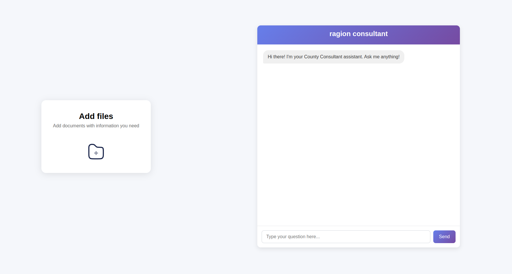

# Ragion

A smart, AI-powered document search and retrieval tool for civil engineers  
_Efficiently find codes, regulations, and technical manuals—no more manual digging or outdated notes._

---

- [Blog Post: Project Design Document](https://fulphrone.netlify.app/blog/) — Further discussion about some of the issues I faced with the project.

## Table of Contents

- [Overview](#overview)
- [Motivation](#motivation)
- [Features](#features)
- [How It Works](#how-it-works)
- [Tech Stack](#tech-stack)
- [Getting Started](#getting-started)
- [Demo](#demo)
- [Roadmap](#roadmap)
  <!-- - [Contributing](#contributing) -->
  <!-- - [License](#license) -->

---

## Overview

**Ragion** is a web application designed to streamline the daily workflow of civil engineers by making it fast and easy to search, retrieve, and reference technical documents such as land development codes, ordinances, and stormwater design manuals.  
It automates what used to be a tedious process eliminating the need to manually browse OneNote, PDFs, or scattered files.

---

## Motivation

Civil engineers spend significant time searching for up-to-date codes, regulations, and technical standards.  
Existing solutions (like shared OneNote notebooks or manual PDF search) are hard to maintain, error-prone, and inefficient—especially when information is updated or phrased differently than expected.

**Ragion** solves this by providing:

- Instant, accurate search across all your technical documents
- Context-aware retrieval, so you find what you need even if you don’t remember the exact wording
- Source citations for every result, so you know exactly where the information comes from

---

## Features

- **AI-Powered Query Response:**  
  Enter questions in your own words; the system uses a Large Language Model (currently Google Gemini) with LangChain and Pinecone to interpret your query and retrieve relevant information from indexed documents.
- **Cited Answers:**  
  Responses are generated based on the most relevant document chunks and include citations or references to the original sources where possible.
- **Jurisdiction Filtering:**  
  Filter results by county or regulation type for precise answers.
- **Real-Time Progress:**  
  See upload and indexing progress instantly in the UI.
- **Easy Upload:**  
  Add new manuals or codes via a simple drag-and-drop interface.
- **Scalable Backend:**  
  Built to handle large document sets and multiple users.

---

## How It Works

1. **Upload Documents:**  
   Civil engineers or admins upload technical documents (PDFs, manuals, codes).

2. **Automated Indexing:**  
   Documents are split into context-preserving chunks, enriched with metadata (like jurisdiction), and indexed for fast retrieval using Pinecone.

3. **AI-Powered Query Response:**  
   Users enter questions in their own words.  
   The system uses a Large Language Model (currently Google Gemini), orchestrated with LangChain and Pinecone, to interpret the user’s query and retrieve relevant information from the indexed documents.  
   Responses are generated by the LLM based on the most relevant document chunks, and include citations or references to the original sources where possible.

> **Note:**  
> The current implementation relies on an LLM (Google Gemini) for interpreting queries and generating responses. While this enables flexible, conversational search, it may not always return the correct quotes from source documents. Future versions may explore pure NLP and semantic search for stricter retrieval and quoting to improve performance.

---

## Tech Stack

- **Frontend:** HTML, CSS, JavaScript
- **Backend:** Python Flask
- **Search/Indexing:** Pinecone (vector database), LangChain
- **AI/NLP:** Google Gemini (LLM)
- **Task Queue:** Celery
- **Progress Tracking:** Redis

---

## Getting Started

1. **Clone the repository**
2. **Install backend dependencies**

pip install -r requirements.txt

4. **Set up environment variables** (see `.env.example`)
5. **Start backend server**

python app.py

Run celery with the following command in another terminal

celery -A tasks worker --loglevel=info

6. **Upload documents and start searching!**

<!-- > _Detailed setup and deployment instructions coming soon._ -->

---

## Demo

<!-- > _Add screenshots or a link to a demo video here._ -->

---

## Roadmap

- Improve search accuracy and context retrieval
- Add more document types and support for additional jurisdictions
- Enhance the UI for better user experience
- Explore using traditional NLP for even lighter, faster search where possible

---

<!-- ## Contributing

Contributions are welcome!
If you have ideas, find a bug, or want to help improve Ragion, please open an issue or submit a pull request. -->

<!-- ---

## License

MIT License

--- -->
